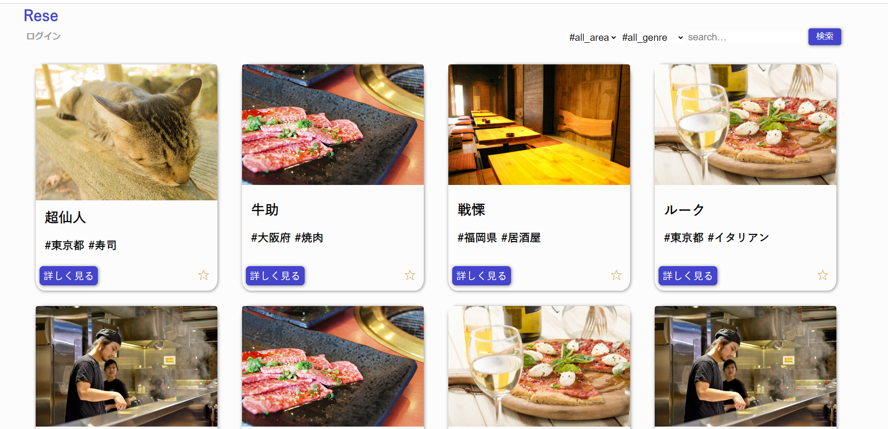
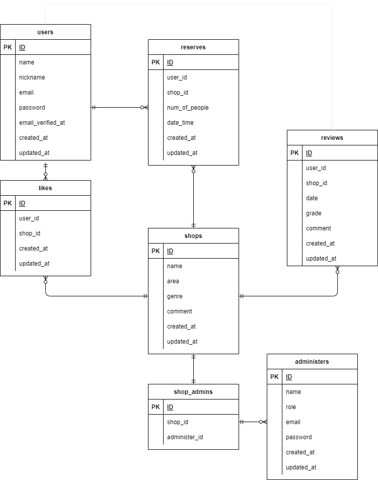

<h1>アプリケーション説明</h1>
<h2>Rese（リーズ）</h2>
<h3>ある企業のグループ会社の飲食店予約サービス</h3>  

<h3>##作成した目的##</h3>

外部の飲食店予約サービスは手数料を取られるので自社で予約サービスを持ちたい。

<h2>##アプリケーションURL##</h2>
<h3>http://13.230.153.221/</h3>

<h2>##機能一覧##</h2>
<h3>ログイン機能(ユーザー・管理者・店舗代表者)</h3>

-ユーザー機能

<ul>
<li>予約機能</li>
<li>予約変更機能</li>
<li>お気に入り機能</li>
<li>店舗レビュー機能</li>
<li>リマインド機能(当日予約確認:QRコード付)</li>
</ul>

管理者機能

<ul>
<li>店舗代表者登録・編集機能</li>
</ul>

店舗代表者機能

<ul>
<li>店舗情報編集機能</li>
<li>予約変更機能</li>
<li>メール連絡機能</li>
</ul>

<h2>##使用技術##</h2>
<ul>
<li>Laravel 8.X</li>
<li>vue.js 2</li>
<li>Amazon Web Service</li>
<li>MySQL</li>
</ul>

<h2>##テーブル設計##</h2>
<h3>users</h3>
<table>
<tr><th>column</th><th>data_type</th><th>not_null</th><th>foreign_key</th><th>options</th></tr>
<tr><td>id</td><td>unsighned bigiht</td><td>〇</td><td></td></tr>
<tr><td>name</td><td>varchar(20)</td><td>〇</td><td></td></tr>  
<tr><td>nickname</td><td>varchar(20)</td><td>〇</td><td></td></tr>  
<tr><td>email</td><td>varchar(100)</td><td>〇</td><td></td><td>unique</td></tr>
<tr><td>password</td><td>varchar(20)</td><td>〇</td><td></td><td></td></tr>
<tr><td>created_at</td><td>timestamp</td><td></td><td></td><td></td></tr>
<tr><td>updated_at</td><td>timestamp</td><td></td><td></td><td></td></tr>
</table>

<h3>shops</h3>
<table>
<tr><th>column</th><th>data_type</th><th>not_null</th><th>foreign_key</th><th>options</th></tr>
<tr><td>id</td><td>unsighned bigiht</td><td>〇</td><td></td></tr>
<tr><td>name</td><td>varchar(20)</td><td>〇</td><td></td></tr>  
<tr><td>area</td><td>varchar(20)</td><td>〇</td><td></td></tr>  
<tr><td>genre</td><td>varchar(20)</td><td>〇</td><td></td><td></td></tr>
<tr><td>comment</td><td>varchar(255)</td><td>〇</td><td></td><td></td></tr>
<tr><td>created_at</td><td>timestamp</td><td></td><td></td><td></td></tr>
<tr><td>updated_at</td><td>timestamp</td><td></td><td></td><td></td></tr>
</table>

<h3>likes</h3>
<table>
<tr><th>column</th><th>data_type</th><th>not_null</th><th>foreign_key</th><th>options</th></tr>
<tr><td>id</td><td>unsighned bigiht</td><td>〇</td><td></td><td></td></tr>
<tr><td>user_id</td><td>integer</td><td>〇</td><td>user(id)</td><td></td></tr>  
<tr><td>shop_id</td><td>integer</td><td>〇</td><td>shop(id)</td><td></td></tr>  
<tr><td>created_at</td><td>timestamp</td><td></td><td></td><td></td></tr>
<tr><td>updated_at</td><td>timestamp</td><td></td><td></td><td></td></tr>
</table>

<h3>reviews</h3>
<table>
<tr><th>column</th><th>data_type</th><th>not_null</th><th>foreign_key</th><th>options</th></tr>
<tr><td>id</td><td>unsighned bigiht</td><td>〇</td><td></td><td></td></tr>
<tr><td>user_id</td><td>integer</td><td>〇</td><td>user(id)</td><td></td></tr>  
<tr><td>shop_id</td><td>integer</td><td>〇</td><td>shop(id)</td><td></td></tr>  
<tr><td>date_time</td><td>datetime</td><td>〇</td><td></td><td></td></tr>  
<tr><td>grade</td><td>small_int</td><td>〇</td><td></td><td></td></tr>  
<tr><td>comment</td><td>varchar(255)</td><td>〇</td><td></td><td></td></tr>  
<tr><td>created_at</td><td>timestamp</td><td></td><td></td><td></td></tr>
</table>

<h3>reserve</h3>
<table>
<tr><th>column</th><th>data_type</th><th>not_null</th><th>foreign_key</th><th>options</th></tr>
<tr><td>id</td><td>unsighned bigiht</td><td>〇</td><td></td><td></td></tr>
<tr><td>user_id</td><td>integer</td><td>〇</td><td>user(id)</td><td></td></tr>  
<tr><td>shop_id</td><td>integer</td><td>〇</td><td>shop(id)</td><td></td></tr>  
<tr><td>num_of_people</td><td>integer</td><td>〇</td><td></td><td></td></tr>  
<tr><td>date_time</td><td>datetime</td><td>〇</td><td></td><td></td></tr>  
<tr><td>created_at</td><td>timestamp</td><td></td><td></td><td></td></tr>
<tr><td>updated_at</td><td>timestamp</td><td></td><td></td><td></td></tr>
</table>

<h3>administers</h3>
<table>
<tr><th>column</th><th>data_type</th><th>not_null</th><th>foreign_key</th><th>options</th></tr>
<tr><td>id</td><td>unsighned bigiht</td><td>〇</td><td></td><td></td></tr>
<tr><td>name</td><td>varchar(20)</td><td>〇</td><td></td><td></td></tr>  
<tr><td>role</td><td>integer</td><td>〇</td><td></td><td></td></tr>  
<tr><td>email</td><td>varchar(100)</td><td>〇</td><td></td><td>unique</td></tr>
<tr><td>password</td><td>varchar(20)</td><td>〇</td><td></td><td></td></tr>
<tr><td>created_at</td><td>timestamp</td><td></td><td></td><td></td></tr>
<tr><td>updated_at</td><td>timestamp</td><td></td><td></td><td></td></tr>
</table>

shops_administers

<table>
<tr><th>column</th><th>data_type</th><th>not_null</th><th>foreign_key</th><th>options</th></tr>
<tr><td>id</td><td>unsighned bigiht</td><td>〇</td><td></td><td></td></tr>
<tr><td>shop_id</td>integer<td>〇</td><td>shop(id)</td><td></td></tr>  
<tr><td>administer_id</td>integer<td>〇</td><td>administer(id)</td><td></td></tr>  
<tr><td>name</td>varchar(20)<td>〇</td><td></td><td></td></tr>  
<tr><td>created_at</td><td>timestamp</td><td></td><td></td><td></td></tr>
<tr><td>updated_at</td><td>timestamp</td><td></td><td></td><td></td></tr>
</table>

<h2>##ER図##</h2>

<h2>##環境構築##</h2>
<ul>
<li>php8.1.12</li>
<li>php-extention:gd,ImageMagick</li>
<li>web-server:nginx/1.22.0</li>
<li>database:mysql(local:ver.15.1)(AWS:ver.8.0.31)</li>
<li>node:v16.17.1</li>
<li>nmp:ver8.15</li>
<li>
added package
<ul>
<li>"league/flysystem": "^1.1"</li>
<li>"league/flysystem-aws-s3-v3": "~1.0"</li>
<li>"league/flysystem-cached-adapter": "~1.0"</li>
<li>"simplesoftwareio/simple-qrcode": "^4.2"</li>
</ul>
</li>
</ul>

